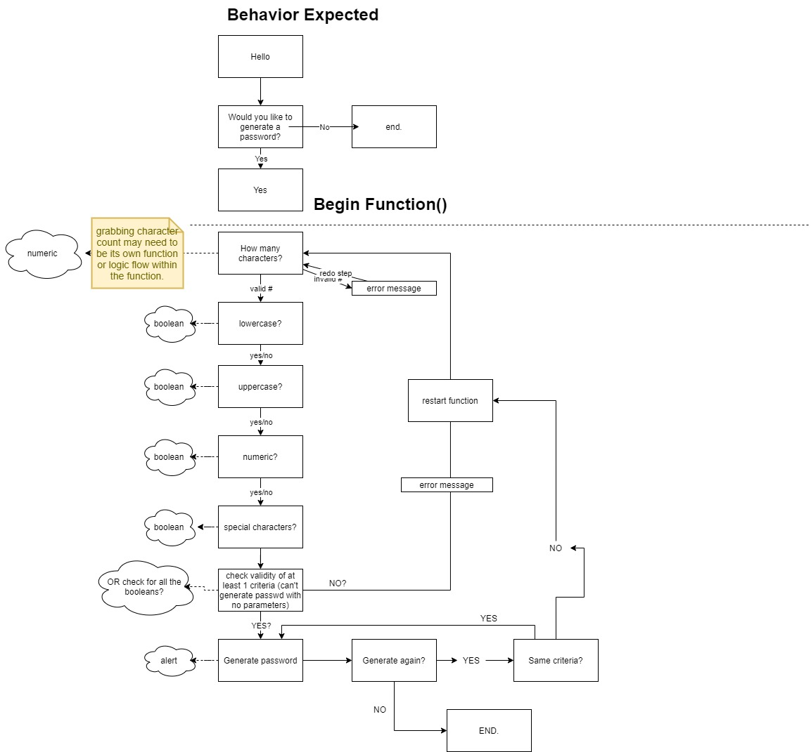
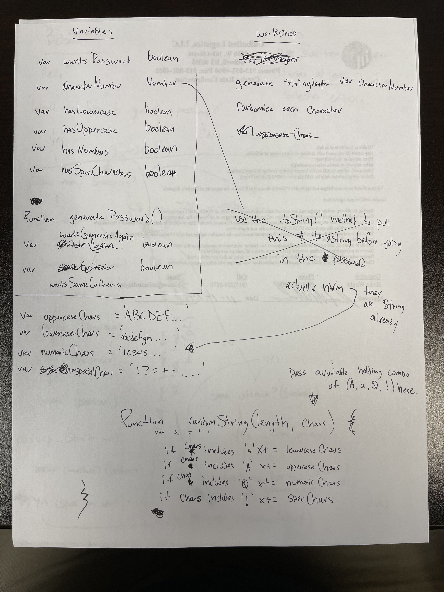

# Password-Generator

> Creates a random password based on user stipulations for multiple criteria.

Uses 4 criteria (lowercase, uppercase, numeric, special) character types and generates a password between 8-128 characters long based on what the user chooses. Can run multiple times. Also guarantees that at least 1 of each selected criteria will be represented in the password.

## Installation

The deployed website can be accessed at the below link.

https://btdubbzzz.github.io/Portfolio-Website/

## Process / What I learned

### 1. Getting started:

I decided to come up with a roadmap for this project before getting started and I think it helped a lot with keeping things organized once I did start inputting code. Below are my pre-project outlines that were the starting point for this app.

### 2. The process

I had a pretty iterative process through this - brainstorm, input, test, refine. And I did this for basically each section of the project. The sections I had the most difficulty with were probably trying to ensure that each user-selected criteria is represented 100% of the time. I feel in most versions of this application you're going to have a non-zero chance of missing a character type, especially with small password lengths and all 4 criteria selected (for example, if you chose 8 character password but all 4 character types, the 'pool' you are selecting from is something like 65 characters and there's technically a chance you can return 8 lowercase letters only). So this is why I created the ensureEachCriteria function, which starts the password build with exactly 1 character of each selected criteria, then adds the rest on after that has been ensured.

## Meta

Blake Wright – [My GitHub](https://github.com/BTDubbzzz) – wright.blake.t@gmail.com

[https://github.com/yourname/github-link](https://github.com/dbader/)

## Contributing

1. A shuffle Array function from Stack Overflow
